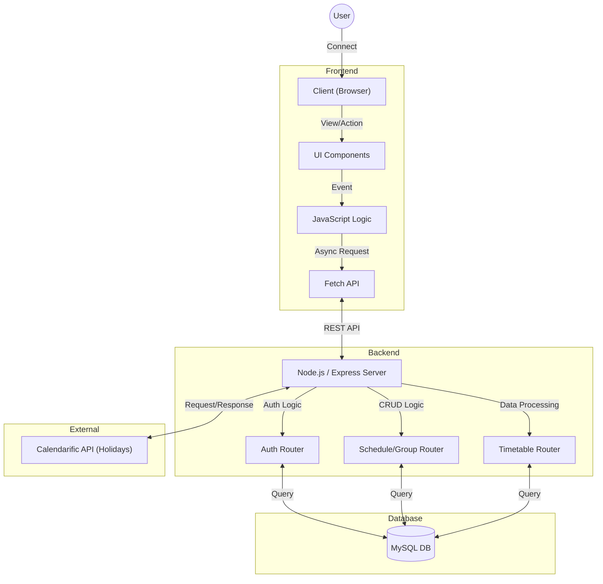

# 📅 Co-Cal (Collaborative Calendar)
**Co-Cal**은 스터디 그룹원 간의 일정을 손쉽게 조율하고, 개인의 학습 기록을 체계적으로 관리할 수 있는 **스터디 전용 일정 관리 웹 서비스**입니다.

---

## 1. 웹 서비스 주제
* **개인 학습 관리:** 달력 기반의 학습 내용 기록 (CRUD) 및 달성 현황 시각화
* **스터디 그룹 협업:** 그룹 생성, 멤버 초대/관리 및 그룹원 간 학습 캘린더 공유
* **일정 조율 자동화:** 구성원들의 가능한 시간(Block)을 시각적으로 겹쳐 보여주는 히트맵(Heatmap) 기반 시간표 기능

---

## 2. 주제 선정 배경 및 이유
1.  **일정 조율의 어려움 해소:** 스터디 모임 시마다 메신저로 시간을 맞추는 번거로움을 해결하기 위해, 모두의 '가능한 시간'을 한눈에 볼 수 있는 기능이 필요했습니다.
2.  **함께하는 학습 동기 부여:** 서로의 공부 기록(빨간 점)을 공유함으로써 '함께 공부하고 있다'는 유대감을 형성하고 학습 의지를 높이고자 했습니다.
3.  **효율적인 일정 관리:** 공휴일 정보 자동 연동과 직관적인 UI를 통해 스터디 일정을 쉽게 계획하고 수정할 수 있도록 기획했습니다.

---

## 3. 개발 언어 및 사용 도구/라이브러리

| 분류 | 기술 스택 | 비고 |
| :--- | :--- | :--- |
| **Frontend** | **HTML5, CSS3, JavaScript (Vanilla)** | Tailwind CSS (CDN) 활용 |
| **Backend** | **Node.js, Express.js** | RESTful API 서버 구축 |
| **Database** | **MySQL** | 관계형 데이터베이스 (RDBMS) |
| **API** | **Calendarific API** | 공휴일 정보 자동 연동 |
| **Library** | `mysql2`, `dotenv`, `node-fetch` | DB 연결 및 환경변수 관리 |
| **Collaboration** | **GitHub** | 버전 관리 및 협업 |

---

## 4. 전체 시스템 개요도

### 시스템 아키텍처
전체 시스템은 **Client(브라우저)**, **Web Server(Node.js)**, **Database(MySQL)**의 3계층 구조로 동작하며, 외부 공휴일 정보를 위해 **External API**와 통신합니다.


### 시스템 동작 원리
- **사용자 인증 (Auth Module)**: 사용자가 로그인하면 DB의 users 테이블을 조회하여 인증하고, 세션 정보를 클라이언트에 유지합니다.
- **일정 관리 (Schedule Module)**: 사용자가 달력에 기록을 남기면 schedules 테이블에 저장되며, 달력 렌더링 시 해당 날짜에 시각적 지표(Dot)를 표시합니다.
- **그룹 협업 (Group Module)**:
       - study_groups와 group_members 테이블을 통해 N:M 관계를 관리합니다.
       - 방장은 가입 신청(group_join_requests)을 승인하거나 멤버를 추방할 수 있는 권한을 가집니다.
- **시간표 조율 (Timetable Module)**:
       - 개인이 study_timetable에 자신의 가능 시간을 드래그하여 입력합니다.
       - 서버는 그룹원들의 시간을 집계(COUNT)하여, 많이 겹치는 시간대일수록 진한 색상으로 클라이언트에 반환합니다.

---

## 5. 팀 멤버 별 담당 업무

| 이름 | 담당 업무 |
| :--- | :--- |
| **조수영** |  • 스터디 그룹 검색 및 가입 신청/승인 프로세스 개발<br>• 학습기록 CRUD 및 그룹 관리 로직 구현 |
| **서윤재** |  • Calendarific API 연동 및 공휴일 처리 로직 구현<br>• 로그인/회원가입 및 계정 관리 API 개발 |
| **정지은** |  • 전체 UI/UX 디자인 및 Tailwind CSS 스타일링<br>• 타임테이블(시간표) 데이터 집계 및 저장 로직 구현 |

---

## 6. 설치 및 실행 방법

1.  **Repository Clone**
    ```bash
    git clone [https://github.com/your-repo/Co-Cal.git](https://github.com/your-repo/Co-Cal.git)
    cd Co-Cal
    ```

2.  **의존성 패키지 설치**
    ```bash
    npm install
    ```

3.  **환경 변수 설정 (.env)**
    루트 디렉토리에 `.env` 파일을 생성하고 아래 정보를 입력합니다.
    ```ini
    DB_HOST=localhost
    DB_USER=your_db_user
    DB_PASSWORD=your_db_password
    DB_NAME=cocal_db
    CALENDARIFIC_API_KEY=your_api_key
    ```

4.  **서버 실행**
    ```bash
    npm start
    ```
    * *서버 실행 시 `init-db.js`가 동작하여 필요한 DB 테이블과 초기 샘플 데이터가 자동으로 생성됩니다.*

5.  **접속**
    브라우저에서 `http://localhost:3000` 으로 접속합니다.
    * **테스트 계정(email/password):**
      - `test@cocal.com` / `1234`
      - `coworker@cocal.com` / `1234`
